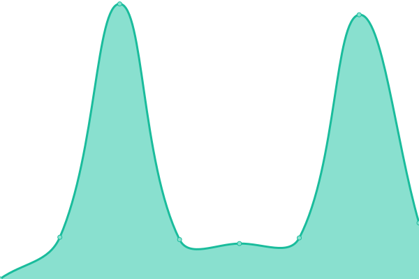
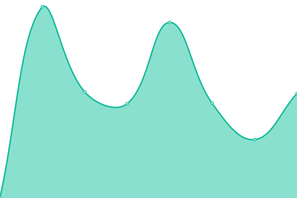

# [📈 Live Status](https://armanijohnny.github.io/SiteUpptime): <!--live status--> **🟩 All systems operational**

This repository contains the open-source uptime monitor and status page for [armanijohnny](https://armanijohnny.github.io/SiteUpptime), powered by [Upptime](https://github.com/upptime/upptime).

With [Upptime](https://upptime.js.org), you can get your own unlimited and free uptime monitor and status page, powered entirely by a GitHub repository. We use [Issues](https://github.com/armanijohnny/SiteUpptime/issues) as incident reports, [Actions](https://github.com/armanijohnny/SiteUpptime/actions) as uptime monitors, and [Pages](https://armanijohnny.github.io/SiteUpptime) for the status page.

<!--start: status pages-->
<!-- This summary is generated by Upptime (https://github.com/upptime/upptime) -->
<!-- Do not edit this manually, your changes will be overwritten -->
<!-- prettier-ignore -->
| URL | Status | History | Response Time | Uptime |
| --- | ------ | ------- | ------------- | ------ |
|  [Donga Labs](http://www.dongalabs.com/) | 🟩 Up | [donga-labs.yml](https://github.com/armanijohnny/SiteUpptime/commits/HEAD/history/donga-labs.yml) | 

 2578ms
     
 | 

<a href="https://armanijohnny.github.io/SiteUpptime/history/donga-labs">100.00%</a>
    

|  [Tokyo Disney Park](https://tokyodisneypark.com/) | 🟩 Up | [tokyo-disney-park.yml](https://github.com/armanijohnny/SiteUpptime/commits/HEAD/history/tokyo-disney-park.yml) | 

 4764ms
     
 | 

<a href="https://armanijohnny.github.io/SiteUpptime/history/tokyo-disney-park">100.00%</a>
    

|  [molti.com](https://www.molti.com/) | 🟩 Up | [molti-com.yml](https://github.com/armanijohnny/SiteUpptime/commits/HEAD/history/molti-com.yml) | 

 714ms
     
 | 

<a href="https://armanijohnny.github.io/SiteUpptime/history/molti-com">100.00%</a>
    

|  [MLZ](https://www.myloanzone.com/) | 🟩 Up | [mlz.yml](https://github.com/armanijohnny/SiteUpptime/commits/HEAD/history/mlz.yml) | 

 433ms
     
 | 

<a href="https://armanijohnny.github.io/SiteUpptime/history/mlz">100.00%</a>
    

<!--end: status pages-->

[**Visit our status website →**](https://armanijohnny.github.io/SiteUpptime)

## 📄 License

- Powered by: [Upptime](https://github.com/upptime/upptime)
- Code: [MIT](./LICENSE) © [armanijohnny](https://armanijohnny.github.io/SiteUpptime)
- Data in the `./history` directory: [Open Database License](https://opendatacommons.org/licenses/odbl/1-0/)
